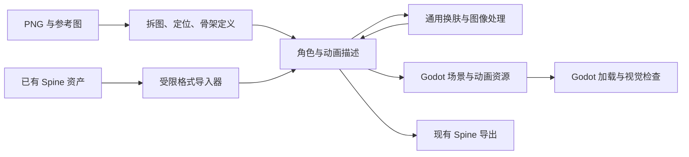

# Codex、GPT Image 2.5 与 Godot 原生动画适配评估

评估日期：2026-09-19。范围：仓库代码审阅、官方文档核对和不调用外部服务的检查。
用户选择：以 Godot 4.x 原生 2D 骨骼／切片动画为目标，可在 Godot 内继续编辑。
本文保留首次评估和迁移规划；后续已实现的 Codex 换肤交接流程见文末“实施进展”。Godot 导出尚未实现。

## 1. 结论

项目值得复用，但现在是“Claude 工作流 + Spine 工具脚本 + Spine 换肤 Web 应用”，还不是通用的 2D 动画工具。

推荐分开处理三个问题：

1. Codex 负责理解素材、组织任务、调用工具和检查结果；用精简的项目规则、技能和明确的 CLI 支持它。
2. 图像生成／编辑通过可切换 Provider 接入 GPT Image 2.5；优先验证 Sunburst 的换肤与局部编辑效果。
3. 角色和动画使用引擎无关的数据模型，新增 Godot 原生导出，逐步解除 Web 应用对 Spine 的依赖。

Godot 第一版交付 `.tscn` 场景、动画资源和 PNG，使用 `Skeleton2D` / `Bone2D` / `Sprite2D` / `AnimationPlayer`。网格变形再增加 `Polygon2D` 和权重。`AnimationTree` 用于播放状态与混合，它使用 `AnimationPlayer` 中的动画，不能代替动画生成和存储。[Godot 骨骼教程](https://docs.godotengine.org/en/stable/tutorials/animation/2d_skeletons.html)、[AnimationTree](https://docs.godotengine.org/en/stable/tutorials/animation/animation_tree.html)

## 2. 代码现状与优先修复点

| 部分 | 代码证据 | 适配影响 |
| --- | --- | --- |
| 代理工作流 | `SKILL.template.md:19` 要求把脚本复制到 `/home/claude/spine-scripts/`，使用 `--break-system-packages` | 不适合 Windows 本地 Codex；应直接运行仓库脚本并使用虚拟环境 |
| 技能体积 | 根 `SKILL.md` 为自动生成的约 73 KB、1995 行文档，嵌入所有脚本 | 适合复制到 Claude Projects；仓库内执行需要另一个精简入口 |
| 工作流断点 | `scripts/position_parts.py:478` 输出 `parts` / `z_order`；`scripts/build_spine_json.py:490` 必须读取 `bones` | README 中把 `layout.json` 直接送入骨架生成器不能成立；需要明确的建骨架步骤 |
| Provider 接口 | `reskin-app/app/backend/ai/base.py:22` 已有 `ImageEditProvider` | 可以增量增加 OpenAI 实现；但协议未声明调用方正在使用的 `reference_images` / `metadata` |
| 模型实例 | `reskin-app/app/backend/server.py:73` 直接缓存 `GeminiProvider()` | 需要 Provider 工厂、设置项，以及切换配置后的客户端更新 |
| 前端密钥检查 | `App.tsx:60`、`PartEditor.tsx:83` 写死 Gemini 和 FAL 两个密钥 | 仅增加后端 OpenAI 类仍会被前端阻挡；应按操作与 Provider 决定依赖 |
| 并发执行 | `ai/gemini.py:156` 在 `async def` 内调用同步网络接口 | 长时间出图会阻塞该事件循环；采用异步客户端或线程隔离 |
| 项目类型 | `backend/projects.py:91` 强制保存 Spine JSON；打开项目只找 Spine 文件 | 增加 Godot 导出不等于应用已支持打开原生 Godot 项目 |
| 预览与快照 | `frontend/src/components/canvas/SpineCanvas.tsx` 使用 `spine-pixi-v8`；`reskin/pipeline.py:63` 的 atlas 模式依赖前端上传快照 | Codex 无界面运行需要显式参考图／渲染入口；Godot 模式需要独立预览方案 |
| 导出与换肤 | `backend/spine/`、`server.py:849`、`reskin/atlas_rebake.py` 写入 Spine 皮肤和图集 | 图像处理可复用，但落盘格式需要拆出导出适配器 |
| 拆图 SDK | `scripts/split_character.py:13` 提示安装 `google-generativeai`，第 40 行实际导入 `google.genai` | 文档与后端使用的 `google-genai` 不一致，先统一安装说明和依赖 |

本次在内存中用定位器输出结构调用 `build_spine_json()`，复现了 `KeyError: 'bones'`。定位得到的是部件位置，不包括关节枢轴、骨骼父子关系、部件语义。这些信息必须由骨架模板、用户编辑或代理结合图像判断补齐，并经过预览确认。

## 3. Codex 适配

### 建议的仓库入口

新增根 `AGENTS.md`，只放长期有效的项目约定：目录职责、Windows/Linux 命令、依赖安装、检查方式、生成文件来源、资产输出位置。UI 工作沿用 `reskin-app/CLAUDE.md` 和现有设计系统。

新增 `.agents/skills/character-animation/SKILL.md`，描述“检查素材 → 拆图 → 定位 → 明确骨架 → 动画 → 导出 → 视觉检查”的流程。通过相对仓库路径引用脚本和格式文档，避免把脚本再复制到固定用户目录。根 `SKILL.md` 保持现有自动生成用途；如要改它的内容，应修改模板并运行 `build_skill.py`。

这种分工对应 Codex 的项目规则与渐进加载技能机制；本地仓库技能的发现目录是 `.agents/skills`。[OpenAI 官方自定义文档](https://developers.openai.com/zh-Hans/docs/customization/overview)

### 优先做 CLI，再考虑 MCP

建议新增统一 CLI，提供 `doctor`、`inspect`、`split`、`rig`、`reskin`、`export`、`validate`。这些是拟定的子命令，当前仓库尚不存在。

每一步接受显式项目路径，输出 JSON 摘要、生成文件列表和可诊断的退出码。记录输入摘要、模型、参数、耗时和失败阶段，以便继续任务。把 `--reference`、`--output-dir` 和 `--target godot|spine` 做成显式参数，避免依赖浏览器当前选中的角色或服务器全局 `_State`。

Codex 在本地可先调用 CLI。需要跨进程访问正在运行的工作室时，再给同一服务层加 MCP 包装；不要把 HTTP 请求状态或 UI 点击作为唯一自动化接口。

运行前用 `doctor` 检查 Python、图像依赖、Node、目标 Godot 可执行文件和所选 Provider 的配置。只报告密钥是否配置，不打印密钥。明确区分本地 Codex 可用的图像工具与这个独立 Web 应用的后端 API；应用接入需要自己的服务端 API 配置。

## 4. GPT Image 2.5 接入

### 型号与端点

截至核对日期，官方明确列出 `gpt-image-2.5-sunburst` 与 `gpt-image-2.5-flare`，也有 `2026-09-08` 快照。Sunburst 面向编辑精度，Flare 面向快速生成。根据项目以保持角色结构的换肤为主，建议先以 Sunburst 做质量基线，Flare 留作可选快速模式；这属于基于产品定位的选择，尚未在本项目素材上实测。[Sunburst](https://developers.openai.com/api/docs/models/gpt-image-2.5-sunburst)、[Flare](https://developers.openai.com/api/docs/models/gpt-image-2.5-flare)

现有业务主要是修改输入图片，采用 Image API 的 `/v1/images/edits`。真正从文字新建图片再使用 generations。返回的 `b64_json` 解码后保存 PNG；不照搬 Gemini 的响应解析和宽高比枚举。[图像编辑 API](https://developers.openai.com/api/reference/resources/images/methods/edit)

### 需要一起修改的代码

| 文件／模块 | 建议改动 |
| --- | --- |
| `ai/base.py` | 完整定义编辑输入、参考图、可选 mask、输出路径和结构化结果；结果含模型、原始尺寸、实际尺寸、usage 和请求标识（可用时） |
| 新增 `ai/openai_image.py` | 异步编辑请求、base64 解码、空输出／拒绝／限流／超时处理、临时文件写入后替换 |
| 新增 Provider 工厂；`server.py` | 从配置选择 `openai` / `gemini`，移除具体类依赖；处理配置或密钥变更后的缓存失效 |
| `settings.py` / `secrets_store.py` / `.env.example` | 增加 OpenAI 密钥和 Provider／model／quality 设置；真实密钥留在服务端 |
| `pipeline.py` / 日志 | 将 `gemini_*` 事件改为通用图像编辑事件，记录实际 Provider；统一参考图角色和尺寸变换 |
| `App.tsx` / `PartEditor.tsx` / 设置 UI | 按后端返回的操作依赖检查密钥；增加 Provider、型号、质量选择 |
| `requirements.txt` / `scripts/split_character.py` | 增加经验证的 OpenAI SDK 依赖；拆图脚本也走共享 Provider，避免只迁移 Web 应用 |

不在网络超时后无条件重复付费出图。长任务需要请求状态、超时配置、可追踪的错误；若引入任务队列，再统一任务 ID、进度和取消语义。

### 图像约束必须显式处理

- 尺寸：2.5 支持自定义大小，但两边需为 16 的倍数、宽高比在 1:3 至 3:1、最长边不超过 3840，像素总数也有限制。小部件与超宽图集不能直接以原尺寸请求；应计算缩放和留白，保存可逆坐标映射。超大合成图考虑分块。[图像输出参数](https://developers.openai.com/api/docs/guides/image-generation#size-and-quality-options)
- 几何：把结果缩放回原尺寸，只能保证画布大小，不能保证眼睛、关节或轮廓没移动。检查关键部件位置、mask 覆盖、缺失／多出部件；不满足要求时保留失败结果并报告，避免自动替换合格素材。
- 透明度：先保持现有白底合成流程，降低分割管线变化。单部件可验证透明 PNG；透明背景不提供部件身份，也不能替代 SAM 的分区。只有验证 alpha 和轮廓后，才对适用路径省略 Bria。SAM、Bria 应按所选分割流程成为依赖，而非所有出图操作的统一前置条件。
- 局部编辑：当前 `inpaint_slot()` 实际是整张单部件重绘，未向模型提供编辑 mask。真正的局部编辑要转换 UI 的黑白 mask 为 API 所需 alpha mask，明确透明处可编辑，并固定主图与参考图的顺序。若要求保护区域逐像素不变，应在模型输出后用原图合成保护区域。[编辑与 mask 指南](https://developers.openai.com/api/docs/guides/image-generation)
- 接口参数：现有 `negative_prompt` 可合并为提示约束；不要原样作为未定义的 API 字段发送。多图请求要与提示中的“第一张图”语义一致。

## 5. Godot 原生路线

### 先增加导出，再逐步支持原生项目

第一步复用当前例子的简单 Spine 数据作为输入夹具，转换为通用角色描述，再导出 Godot 资源。新素材通过“PNG + 布局 + 骨架定义”进入同一描述，之后无需先生成 Spine JSON。



通用描述至少包括 `schema_version`、坐标约定、骨骼父子关系与初始变换、部件纹理／枢轴／绘制顺序、皮肤的纹理与变换覆盖、动画轨道与循环语义。骨骼角色映射（头、躯干、左右上下肢）应独立于文件名，否则当前按固定骨骼名称工作的动画预设会静默缺失轨道。

### 第一版输出

```text
character/
  character.tscn
  animations.tres       # AnimationLibrary
  textures/
  skins/                # 可切换纹理和必要的部件变换
  character.gd          # 小型皮肤切换辅助脚本
  import_report.json    # 输入、导出能力、警告、版本
```

场景根使用 `Node2D`，内部是 `Skeleton2D` 骨架、作为骨骼子节点的刚性 `Sprite2D` 切片和 `AnimationPlayer`。游戏侧可把它实例化到 `CharacterBody2D`；碰撞、移动逻辑与美术动画分开。导出器设置绘制层级，避免骨骼树顺序改变遮挡。

动画包含 `RESET` 初始姿态、idle/walk/run 循环和 wave/jump/attack 一次性动作。可随后提供使用这些动画的 `AnimationTree` 示例。Godot 的切片动画可直接编辑节点变换；需要软组织弯曲时再引入网格蒙皮。[Godot 切片动画](https://docs.godotengine.org/en/stable/tutorials/animation/cutout_animation.html)

建议通过 Godot 自身的 GDScript 构建资源并用 `PackedScene` / `ResourceSaver` 保存，先固定并测试一个明确的 Godot 4.x 小版本。构建场景时设置子节点的 `owner`，避免生成后保存的场景缺节点。第一版使用独立 PNG，之后再增加 `AtlasTexture` 打包。

### 转换中不能省略的语义

| 项目 | 处理要求 |
| --- | --- |
| 坐标与角度 | Spine Y 向上，Godot 2D Y 向下；常规变换需要翻转 Y 和角度方向，并把度转换为弧度。含剪切或特殊继承时按矩阵处理或报告不支持 |
| 初始姿态 | Spine 变换轨道含相对初始姿态的语义；写入 Godot 属性轨道前合成初始位置／角度／缩放，不能直接抄数值 |
| 局部与世界坐标 | 关节位置必须在正确父坐标系中计算；父骨骼旋转后，单纯坐标相减不是完整的逆变换 |
| 纹理与附件 | 恢复 atlas 的旋转、裁边和原始尺寸，保持枢轴；皮肤切换可能同时改变附件变换 |
| 曲线 | `build_spine_json.py` 已区分作者用的归一化曲线和 Spine 4.2 格式；共享作者数据，或正确求值后采样，不能直接把曲线数组当 Godot 缓动参数 |
| 绘制顺序 | 单独映射部件的绘制层级；动画中的 draw order 变化若暂不支持必须提示 |
| 高级附件 | 网格、权重、deform、clipping、IK、路径约束、特殊混合分别列支持矩阵；第一版遇到未支持特性明确失败或要求选择降级方式 |

Godot 的骨骼有相对父级的 rest transform；节点旋转属性使用弧度。[Bone2D](https://docs.godotengine.org/en/stable/classes/class_bone2d.html)、[Node2D](https://docs.godotengine.org/en/stable/classes/class_node2d.html)

### Web 应用的后续调整

提取 `CharacterProject` 和导出适配器，让项目 API 不再必须暴露 `spine_json`。把 `SpineCanvas` 保留为 Spine 预览实现；Godot 目标可先由 Godot 打开导出场景完成编辑与验收，随后再加通用切片预览或 Godot 预览桥接。

原生 Godot 项目接入先支持本工具生成的 manifest 和场景。任意 `.tscn`、脚本动态搭建的角色、第三方骨架插件不能默认宣称可无损导入；需要独立的 Godot 导入／编辑器插件设计。

## 6. 实施顺序与验收

| 阶段 | 交付 | 验收条件 |
| --- | --- | --- |
| P0：可复现工作流 | `AGENTS.md`、精简技能、依赖与启动说明、doctor、骨架输入规范 | Codex 从干净环境能定位依赖问题；定位 → 骨架不再有隐含人工步骤 |
| P1：可切换图像接口 | OpenAI Provider、配置／密钥／UI 完整链路、拆图脚本共用实现 | Gemini 回归通过；OpenAI 全局换肤和单部件编辑通过；模拟空响应、超时、限流和尺寸归一化 |
| P2：Godot 最小闭环 | 通用角色描述、受限 Spine 导入、Godot 导出与示例项目 | 示例六套动画可加载播放、切换皮肤、无错位；Godot 内能继续编辑 |
| P3：原生工作室 | manifest 项目加载、预览适配、无浏览器 CLI 全流程 | PNG 素材可直接生成 Godot 资源，不必先生成 Spine 项目 |
| P4：高级变形 | Polygon2D、网格权重、IK、动画混合及能力报告 | 每种特性有专门素材和视觉回归，不以简单角色通过代替全面兼容 |

P1 与 P2 在通用输入／输出约定明确后可独立实施。优先跑通一个角色的完整闭环，再扩展模型和引擎特性。

Godot 验收包括无界面导入与资源加载检查，以及有渲染环境下的固定时间点截图：初始姿态、动画关键帧、循环连接处、换肤前后。无界面加载成功不能替代视觉检查。[Godot 命令行文档](https://docs.godotengine.org/en/stable/tutorials/editor/command_line_tutorial.html)

现有 `examples/sombrero/skeleton.json` 有 15 根骨骼、12 个 region 附件和六套动画，无 IK／transform／path 约束，适合作为第一版夹具。`sombrero.json` 是另一份 16 骨骼、10 部件、仅 idle 的示例，测试时不要混用两份骨架的纹理和部件假设。

## 7. 首次评估的检查结果与边界

- 工作区开始时无未提交改动。本次仅新增这份评估文档，没有切换模型或迁移运行代码。
- Python 3.12 对根脚本和后端共 30 个 Python 文件完成 AST 语法检查，无语法错误。
- 通过内存调用复现定位输出与骨架生成器的结构不兼容。
- 读取两份示例验证骨骼数、附件类型、动画和约束。
- 当前检查使用的 Python 3.12 环境未安装 Pillow、OpenCV、NumPy、FastAPI、OpenAI SDK；PATH 未发现 `godot` / `godot4`。这不代表机器其他环境没有安装。
- 没有启动 Web 应用、执行付费图像请求或运行 Godot，因此模型画质、完整应用行为和原生导出的兼容性仍需实施阶段验证。

## 8. Spine 功能与 Godot 第一版的保留范围

要区分“项目脚本主动生成的功能”和“Spine runtime 可播放的已导入功能”。
Godot 列描述拟实施的第一版范围，不代表仓库已支持 Godot。

| 功能 | 现有项目 | Godot 原生第一版计划 |
| --- | --- | --- |
| idle / walk / run / wave / jump / attack | `build_spine_json.py` 中六个动作生成器；根据固定骨骼名称输出轨道 | 全部保留，抽出共享动作数据与骨骼角色映射 |
| 动作细节 | 呼吸／摇摆、手脚反向摆动、跑步前倾、挥手振荡、起跳蓄力与落地、攻击前摇与回收 | 保留这些关键帧设计；当前它们是模板动画，不是物理模拟 |
| 父子骨骼、初始姿态、附件偏移 | 骨架 JSON 与附件数据 | 转为 Bone2D 层级和正确的局部变换 |
| 贝塞尔缓动、相位差 | 预设使用曲线和不同部件错峰运动 | 保留，转换曲线或正确采样，不直接复制数组 |
| 自定义动画 | `custom_animations` 可增加或覆盖动作，骨骼轨道转换涵盖旋转、位移、缩放和剪切 | 保留常规变换轨道；剪切和特殊继承先检测并报告，不承诺第一版无损 |
| 静态绘制顺序、部件显隐 | slots 顺序、遮挡分析、预览显隐开关 | 保留；动态换层轨道单列后续支持 |
| 皮肤与局部修图 | 换肤、单部件重绘、蒙版编辑、HSL/RGB/变换 | 保留图像编辑能力；皮肤资源需含纹理和必要的附件变换 |
| 加权网格与 deform | 根脚本未自动创建；runtime 可播放已有素材，换肤路径并未证明全面兼容 | 暂不转换，后续 Polygon2D 与权重支持 |
| IK／路径／变换约束 | 预设和附带示例未使用；输入 Spine 资产可能包含 | 暂不转换，检测到时明确报告 |
| clipping、特殊混合、动画事件 | 没有通用导出转换实现；输入素材可能依赖 runtime | 分别列能力检测与后续支持，不能默默丢弃 |
| 状态机、混合树 | Web 应用主要选择单动画播放，没有完整游戏角色状态机 | 后续用 AnimationTree 接入游戏逻辑，不是现有预设功能的损失 |

针对普通分层角色、骨骼关键帧、六套基础动作和换装，原生 Godot 路线有对应实现。
若输入是高级 Spine 资产，应先做能力扫描；无法转换的特性必须列出，再决定扩展原生导出或沿用 runtime。

## 9. 实施进展：Codex 内生成后导入

现已增加 `reskin/handoff.py`、prepare/list/status/import HTTP 接口、
`scripts/codex_reskin.py` 和仓库技能 `.agents/skills/reskin-in-codex/`。
Web 应用的 Generate 窗口可选择 Codex workflow，准备输入、复制请求、恢复任务，
并自动检测导入完成；也支持手动选择生成图片。

任务保存固定输入、布局和源文件校验值。导入恢复画布映射、复用原始 alpha、
切片并打包新皮肤，不调用 Gemini、OpenAI Image API、SAM 或 Bria。
这条路径依赖 Codex 会话可用的内置图像工具，无法在应用中强制指定其底层模型。
适用于保持部件轮廓的表面换肤，不代表支持自动增添或重构肢体。

原 Gemini 调用路径保留，共享准备和结果拆分逻辑。Godot 导出仍是后续工作，
当前导入生成的是现有 Spine 皮肤与图集。使用步骤与接口见
[Reskin Studio README](../reskin-app/README.md#generate-in-codex)。

验证：16 项后端测试通过，涵盖两种布局、原骨架／动画和透明边缘保留、
重复提交、素材变更、失败重试及原 provider 流程回归；前端 TypeScript/Vite
构建和技能校验通过。浏览器中完成准备任务 → CLI 导入 → 自动显示结果 →
Accept 切换皮肤，并检查 idle 预览。该回环使用原输入作为测试结果，
没有实际调用图像模型，因此尚未验证模型生成质量。
